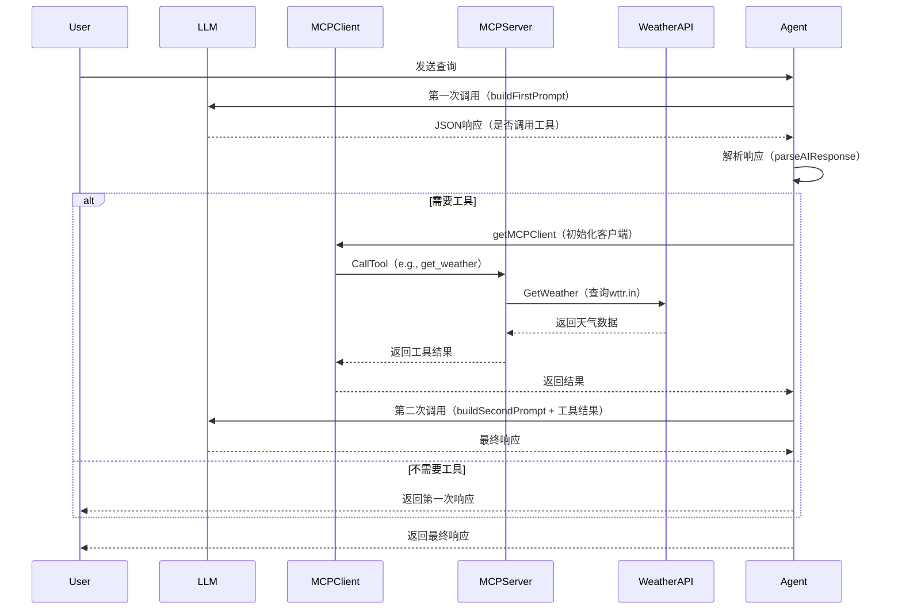

基于你选中的代码文件（`model.go`、`server.go`、`client.go`），我来解释Agent在使用MCP（Model Context Protocol）模式下的整个调用链。MCP模式允许AI模型通过工具调用扩展能力，这里主要集成了天气查询工具。调用链分为几个阶段：初始化、AI决策、工具调用和最终响应。

#### 1. **初始化阶段**
- **MCPModel创建**：在`model.go`的`NewMCPModel`中，创建MCP模型实例。它初始化一个OpenAI兼容的LLM（用于生成响应），并设置MCP服务器的URL（`http://localhost:8081/mcp`）。
- **MCP客户端懒加载**：在`getMCPClient`中，如果客户端未创建，则使用`client.go`的`NewMCPClient`创建HTTP传输客户端，并通过`Initialize`方法连接到MCP服务器（`server.go`中的`StartServer`启动的服务器）。

#### 2. **响应生成阶段（GenerateResponse方法）**
- **第一次LLM调用**：Agent接收用户消息，构建第一次提示词（`buildFirstPrompt`），要求AI以固定JSON格式响应（指示是否调用工具）。调用LLM生成响应。
- **解析AI响应**：使用`parseAIResponse`解析JSON，检查是否需要工具调用（`IsToolCall`字段）。如果不需要，直接返回响应。
- **工具调用准备**：如果需要，获取MCP客户端（`getMCPClient`），然后调用`callMCPTool`执行工具。

#### 3. **工具调用阶段**
- **MCP工具执行**：`callMCPTool`使用`client.go`的`CallTool`方法，向MCP服务器发送工具请求（例如`get_weather`工具）。服务器（`server.go`）处理请求，调用`WeatherAPIClient.GetWeather`从wttr.in API获取天气数据，返回结果。
- **结果处理**：工具结果返回给Agent。

#### 4. **最终响应阶段**
- **第二次LLM调用**：构建第二次提示词（`buildSecondPrompt`），将工具结果注入其中，再次调用LLM生成最终响应。
- **返回响应**：Agent返回最终的AI响应。

#### 5. **流式响应（StreamResponse）**
- 类似`GenerateResponse`，但第二次调用使用流式接口（`llm.Stream`），逐步返回内容。

整个链路依赖于MCP协议：Agent（客户端） -> MCP服务器 -> 外部API（wttr.in）。错误处理包括工具调用失败时回退到第一次响应。

#### Mermaid流程图辅助理解
以下是调用链的简化Mermaid图（使用`sequenceDiagram`表示时序）：

这个图展示了核心流程：Agent作为中介，通过LLM决策是否调用MCP工具。如果需要，工具链路会扩展到外部服务。代码中还有`StreamResponse`的变体，但逻辑类似。