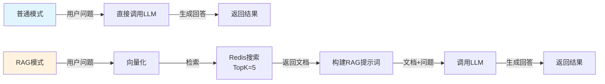
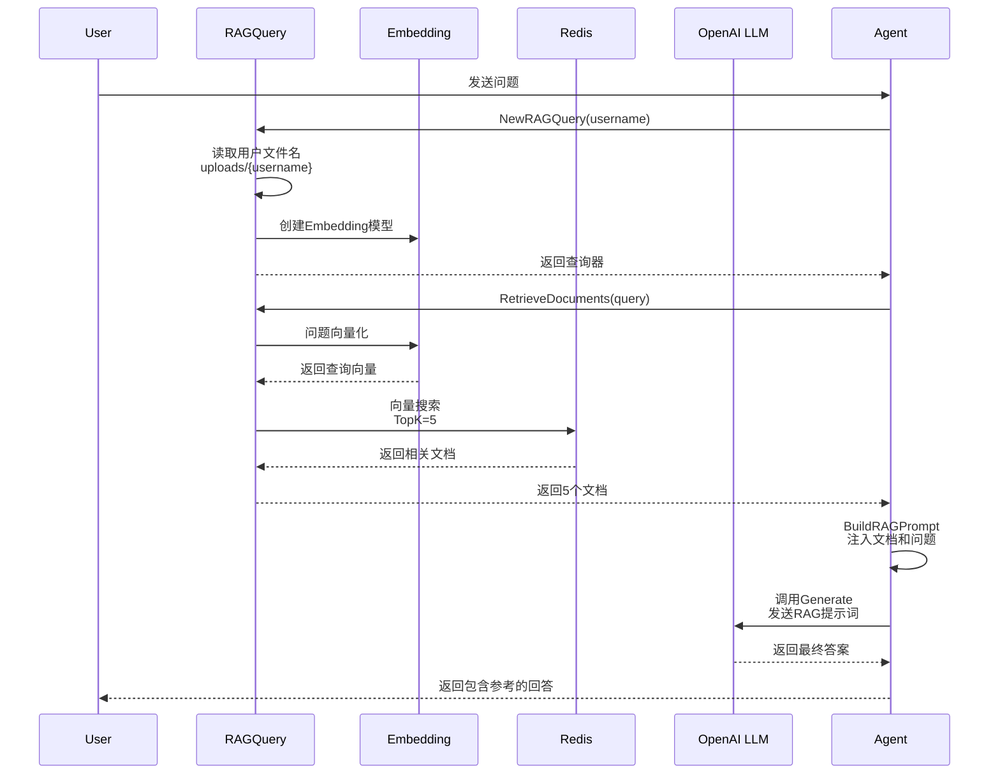
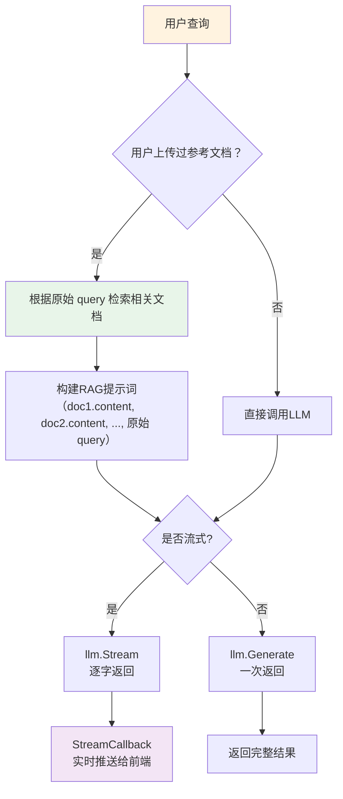

### RAG模式下的Agent调用链详细解释

RAG模式分为两个阶段：**索引阶段**（离线）和**查询阶段**（在线运行）。

---

#### **第一阶段：索引阶段（离线）**

这个阶段发生在用户上传文件时：

1. **创建索引器** → `NewRAGIndexer(filename, embeddingModel)`
   - 初始化Embedding模型（将文本转换为向量）
   - 初始化Redis索引结构
   - 配置索引器的文档存储方式

2. **调用IndexFile** → 读取文件 → 文本切块 → 向量化 → 存储到Redis
   - 每个文本块被向量化后存储为Redis Hash
   - Redis中的数据结构：`{filename}:{doc_id}` → `{"content": 文本, "vector": 向量, "metadata": 元数据}`

---

#### **第二阶段：查询阶段（运行时）**

这是你选中代码的核心逻辑，又分为几个步骤：

**步骤1: 初始化RAG查询器**

```
NewRAGQuery(ctx, username)
  → 读取用户上传目录: uploads/{username}/
  → 找到用户的文件名
  → 创建Embedding模型（与索引阶段相同的模型）
  → 创建Redis Retriever（远程搜索所有向量）
  → 返回RAGQuery实例
```

**步骤2: 检索相关文档**
```
RetrieveDocuments(ctx, query)
  → 用户问题转向量（embedding模型）
  → Redis向量搜索（计算相似度，返回TopK=5）
  → 返回最相关的5个文档片段
```

**步骤3: 构建增强提示词**
```
BuildRAGPrompt(query, docs)
  → 将检索到的文档内容插入提示词
  → 构建包含"参考文档"部分的新提示词
  → 新提示词 = "参考文档1\n...\n参考文档5\n用户问题"
```

**步骤4: 调用LLM生成回答**
```
llm.Generate(ctx, ragMessages)
  → LLM基于"参考文档+用户问题"生成回答
  → 返回最终响应
```

---

#### **错误处理与降级策略**

代码中有两层降级：

1. **无文件情况**：如果用户没有上传文件，直接使用原始问题调用LLM
2. **检索失败**：如果Redis检索失败，也降级为原始问题

---

#### **流程对比：普通模式 vs RAG模式**



#### **RAG完整调用链时序图**



#### **关键数据结构流转**

```
用户问题
    ↓
Embedding模型转换
    ↓
Query Vector (向量)
    ↓
Redis相似度搜索
    ↓
Top-5 文档列表
    ↓
构建RAG提示词：
  参考文档：
  [文档1]：xxx
  [文档2]：xxx
  ...
  [文档5]：xxx
  
  用户问题：xxx
    ↓
调用LLM
    ↓
最终回答
```

#### **关键组件详解**

| 组件 | 作用 | 关键文件 |
|------|------|--------|
| **Embedding** | 文本→向量转换（维度=1536） | `rag.go` - `embeddingArk.NewEmbedder()` |
| **Redis** | 向量存储和相似度搜索 | redis.go |
| **Retriever** | 向量检索引擎（基于Redis） | `rag.go` - `redisRetriever.NewRetriever()` |
| **提示词工程** | 将文档注入提示词 | `rag.go` - `BuildRAGPrompt()` |
| **LLM** | 最终答案生成 | `model.go` - `llm.Generate()` |

#### **流式响应与普通响应的区别**



#### **性能优化点**

1. **向量重用**：同一用户问题只向量化一次
2. **批量处理**：Redis批量存储文档（BatchSize=10）
3. **TopK限制**：只检索Top-5相关文档，减少LLM输入长度
4. **懒加载**：RAGQuery只在需要时创建，减少初始化开销
5. **降级处理**：无文件或检索失败时无损降级

---

#### **与MCP模式的对比**

| 特性 | MCP模式 | RAG模式 |
|------|--------|--------|
| **核心机制** | AI决策是否调用工具 | 自动检索相关文档 |
| **调用次数** | 可能2次LLM调用 | 1次LLM调用 |
| **外部依赖** | HTTP MCP服务器 | Redis向量数据库 |
| **适用场景** | 需要实时查询天气、API等 | 基于知识库的Q&A |
| **文档处理** | 无 | 需要离线索引 |
