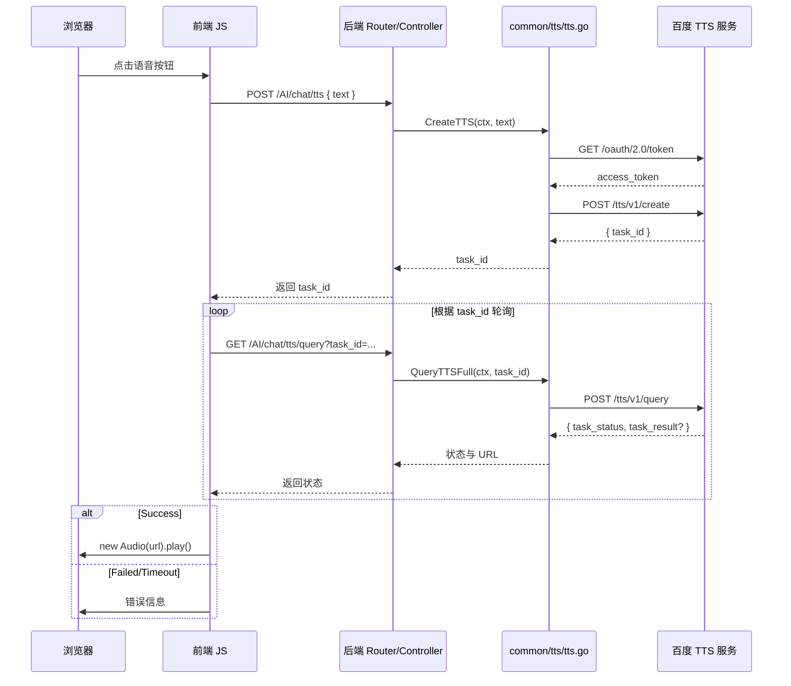

## TTS 服务调用链解释

你选中的内容包含：

- 前端 AIChat.vue 中 `playTTS` 函数
- 后端 tts.go
- 路由 AI.go
- 控制器 tts.go

这条调用链可以拆成三层：

1. 前端触发
2. 后端路由 + 控制器
3. 后端 TTS 服务调用百度接口

---

## 1. 前端触发：`playTTS(text)`

### 关键行为

- 用户点击语音按钮后，`playTTS` 被调用
- 发送第一个请求：
  - `POST /AI/chat/tts`
  - 请求体：`{ text }`
- 如果返回成功，拿到 `task_id`
- 先等待 5 秒，然后进入轮询：
  - `GET /AI/chat/tts/query?task_id={taskId}`
- 直到：
  - `task_status === 'Success'` 且存在 `task_result`
  - 或者超时 / 失败

### 轮询逻辑

- 每次间隔 `pollInterval = 2000ms`
- 最大重试 `maxAttempts = 30`
- 状态判断：
  - `Success`：播放音频
  - `Running` / `Created`：继续轮询
  - 其他：报错“语音合成失败”

---

## 2. 后端路由与控制器

### 路由映射

AI.go 中：

- `POST("/chat/tts", tts.CreateTTSTask)`
- `GET("/chat/tts/query", tts.QueryTTSTask)`

### 控制器逻辑

tts.go

#### CreateTTSTask

- 解析 JSON 参数
- 校验 `text` 非空
- 调用 `tts.ttsService.CreateTTS(c, req.Text)`
- 返回：
  - 成功：`task_id`
  - 失败：`code.TTSFail`

#### QueryTTSTask

- 读取 URL 参数 `task_id`
- 调用 `tts.ttsService.QueryTTSFull(c, taskID)`
- 解析返回结果：
  - `TaskID`
  - `TaskStatus`
  - `TaskResult`（如果有则是音频 URL）
- 返回给前端

---

## 3. 后端 TTS 服务：tts.go

这是核心实现。

### `CreateTTS(ctx, text)`

作用：向百度 TTS 发起“创建任务”请求，返回 `task_id`

步骤：

1. `GetAccessToken()`
   - 请求 `https://aip.baidubce.com/oauth/2.0/token`
   - 参数：
     - `grant_type=client_credentials`
     - `client_id` = `config.VoiceServiceApiKey`
     - `client_secret` = `config.VoiceServiceSecretKey`

2. 构造 TTS 请求体 `TTSRequest`
   - `Text`
   - `Format: mp3-16k`
   - `Voice: 4194`
   - `Lang: zh`
   - 以及 `Speed`, `Pitch`, `Volume`, `EnableSubtitle`

3. POST 到：
   - `https://aip.baidubce.com/rpc/2.0/tts/v1/create?access_token=...`

4. 解析返回 JSON
   - 成功时读取 `task_id`
   - 如果 `task_id` 为空则认为失败

### `QueryTTSFull(ctx, taskID)`

作用：查询百度 TTS 任务状态，取回最终音频 URL

步骤：

1. `GetAccessToken()`（再次获取）
2. 构造请求体：
   - `{"task_ids":["taskID"]}`
3. POST 到：
   - `https://aip.baidubce.com/rpc/2.0/tts/v1/query?access_token=...`
4. 解析返回 JSON
   - 读取 `TasksInfo`
   - 对于 `TaskStatus == "Success"`，如果 `task_result` 存在，则解析 `speech_url`

### 注意点

- `GetAccessToken()` 每次都重新请求，不做缓存
- `QueryTTSFull` 会把底层百度返回的 `task_result` 转成 `SpeechURL`
- 前端接收的 `task_result` 实际上就是音频 URL

---

## 4. 一次完整调用示例

### 1) 用户点击语音按钮

前端调用：

```js
playTTS("今天天气怎么样？")
```

### 2) 创建任务

前端发送：

```http
POST /AI/chat/tts
Content-Type: application/json

{ "text": "今天天气怎么样？" }
```

后端执行：

- `CreateTTSTask`
- `ttsService.CreateTTS(...)`
- 调用百度 OAuth 获取 access_token
- 再调用百度 TTS 创建接口
- 返回如下结果：

```json
{ "status_code": 1000, "task_id": "abc123" }
```

### 3) 前端等待并轮询

前端等待 5 秒后：

```http
GET /AI/chat/tts/query?task_id=abc123
```

后端执行：

- `QueryTTSTask`
- `ttsService.QueryTTSFull(...)`
- 调用百度 TTS 查询接口
- 得到任务状态

可能返回：

```json
{
  "status_code": 1000,
  "task_id": "abc123",
  "task_status": "Created"
}
```

继续轮询。

### 4) 任务完成

后续轮询返回：

```json
{
  "status_code": 1000,
  "task_id": "abc123",
  "task_status": "Success",
  "task_result": "https://.../audio.mp3"
}
```

前端收到后：

```js
const audio = new Audio(queryResponse.data.task_result)
audio.play()
```

### 5) 播放结束

音频直接由浏览器 `Audio` 对象播放，不再经过后端。

---

## Mermaid 调用链



---

## 关键结论

- 前端只负责发起创建任务和轮询查询
- 后端负责转发并解析百度 TTS 接口
- tts.go 是核心：`CreateTTS` + `QueryTTSFull`
- 任务成功后，前端直接播放返回的音频 URL
